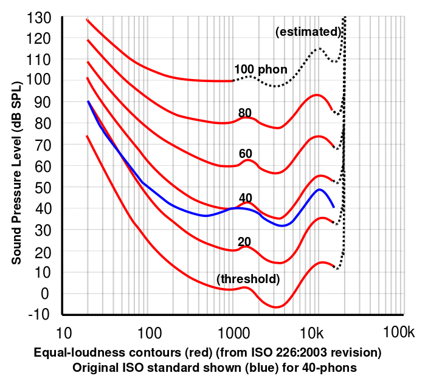
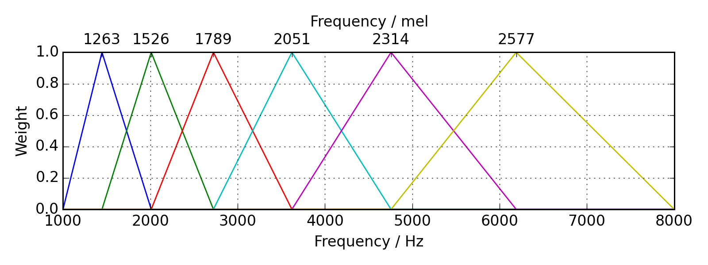
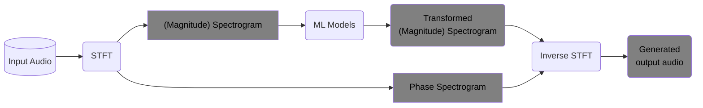
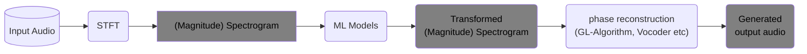
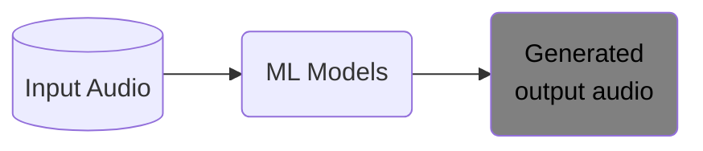

# hf_audio_tutorial
Any audio relevant tutorial, articles etc in Hugging Face.

# Important concept
## Human hearing vs frequencies
### Human loundness vs frequencies
- humane hearing loudness vs frequency: we perceive certain frequencies to be louder or quieter than others, even when they played with an equal amount of energy. In the 1930’s, researchers actually measured this, resulting in the first of many “curves” that try to capture human loudness bias as a function of frequency. In short, humans have natural biases in how we hear loudness at different frequencies.
  
### Human pitch vs frequencies
- humane hearing frequency/pitch vs frequency: humans also have biases in how we hear pitch. Low frequencies sound “low” to us, and higher ones sound “high”, but the relationship between frequency and perception is non-linear – a 100 Hz and 200 Hz sine wave will sound much further apart than a 10,000 Hz and 10,100 Hz wave.
  

## Model architectures

Setting 1: with ML model trained on spectrogram while re-using original phase.

- Magnitude Spectrogram can be the one that is generated directly via STFT, or the one that is one step further as the Mel-spectrogram.

Setting 2: with ML model trained on spectrogram but using some algorithms/vocoders to reconstruct phase from transformed spectrogram and convert result to time-domain audio output.

- Griffin-Lim algorithm uses the intuition that the STFT usually results in the same frequencies being activated in neighboring frames to iteratively come up with a reasonable guess for a phase.
- Vocoders: front-end components that probabilistically generate waveforms given magnitude spectrograms. Instances are WaveNet, WaveGlow, which are commonly used as pretrained vocoders.
  Actually vocoders doesn't no just convert spectrogram to waveform, but also helps to re-adjust the input spectrogram to be more aligned with groundtruth.

Setting 3: (End-to-end) ML model that directly learns from waveform input and gives waveform output

## Learning from Loss

# Articles and/or Links
- [HF Audio Course](https://huggingface.co/learn/audio-course/en/chapter0/introduction):
  It contains from Unit 0 to Unit 8 regarding audio data ETL, various audio related tasks, and model intrudoctions.

- [FAU Prof. Mueller's web](https://www.audiolabs-erlangen.de/fau/professor/mueller)
- [FAU/Preparation Course Python Notebooks](https://www.audiolabs-erlangen.de/resources/MIR/PCP/PCP.html)
- [FAU/Fundamental Musci Preprocessing Notebooks](https://www.audiolabs-erlangen.de/resources/MIR/FMP/C0/C0.html)

- [Loss Functions in Audio ML](https://www.soundsandwords.io/audio-loss-functions/)